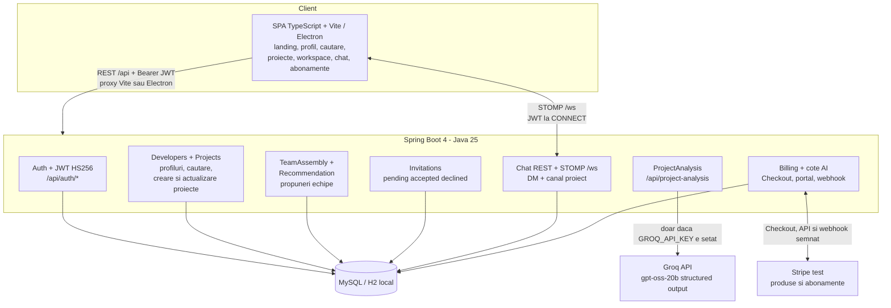
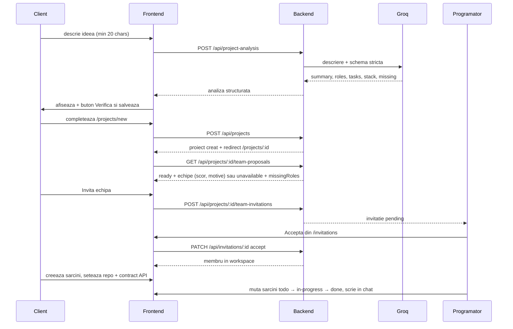

# MicroCrew

MicroCrew este o platforma care conecteaza clientii cu idei de proiecte software cu programatori disponibili pentru colaborare. Un client descrie proiectul in limbaj natural, primeste o analiza structurata generata cu AI (roluri necesare, sarcini, stack existent, clarificari), creeaza proiectul, primeste propuneri de echipe complete (cate un programator distinct pentru fiecare rol), trimite invitatii, iar dupa acceptarea acestora echipa lucreaza intr-un workspace comun cu sarcini tip Kanban, repository si contract API, plus chat direct si pe proiect in timp real.

Repo-ul este un monorepo cu doua aplicatii:

- `backend/dotconn-backend` - API REST + WebSocket (Spring Boot, Java 25)
- `frontend` - SPA fara framework, TypeScript + Vite, disponibila in browser si ca aplicatie Electron

Numele istoric al proiectului in cod si configurari este `dotconn` / `codematch`. Numele de produs actual este MicroCrew.

## Functionalitati

### Conturi si autentificare

- Inregistrare si login cu email + parola (`POST /api/auth/signup`, `POST /api/auth/login`).
- Token JWT HS256 cu valabilitate de 1 ora (`app.jwt.ttl-seconds=3600`), trimis ca `Authorization: Bearer <token>`.
- Parole hash-uite cu BCrypt. Sesiunea este pastrata in memorie si in `sessionStorage`: ramane activa dupa refresh in acelasi tab, pana la expirarea tokenului sau logout. Nu exista refresh token.
- Endpoint de profil curent: `GET /api/me`.

### Profiluri de programatori

Fiecare utilizator isi poate completa profilul (`GET/PATCH /api/me/profile`):

- nume afisat, descriere, link GitHub (`https://github.com/<user>`)
- rol: Frontend, Backend, Full-stack, Mobile, DevOps, QA/testare, Date, Securitate (campul poate lipsi pentru un client pur)
- tehnologii (lista, max 20), experienta in ani, tarif pe ora (moneda inca nedefinita, aceeasi unitate cu plafonul proiectului)
- disponibilitate: disponibil, partial disponibil, indisponibil

Cautare de programatori pentru utilizatori autentificati (`GET /api/developers`, paginat, `size=12` in UI):

- filtre dupa rol, tehnologie si disponibilitate
- pagina de detaliu `/developers/:id` cu link catre chat 1-la-1

### Analiza AI a ideii de proiect

Punctul de intrare din landing page (`#analysis-form`):

1. Utilizatorul scrie o descriere de minimum 20 de caractere.
2. Frontendul apeleaza `POST /api/project-analysis` cu `{ description }`.
3. Backendul apeleaza Groq (model implicit `openai/gpt-oss-20b`, output structural strict) si intoarce:

```json
{
  "summary": "...",
  "roles": ["backend"],
  "tasks": ["..."],
  "existingStack": ["React"],
  "missingInformation": ["Care este bugetul?"]
}
```

4. Rezultatul este afisat pe sectiuni (roluri, sarcini, tehnologii existente, de clarificat) si poate fi preluat ca draft in formularul `/projects/new`.

Analiza necesita autentificare si se incadreaza in cota lunara a planului contului. Numai analizele reusite consuma cota. Rezultatul nu este salvat automat in baza de date: utilizatorul verifica formularul si creeaza proiectul explicit. Schema si validarea controleaza structura raspunsului, fara sa garanteze corectitudinea recomandarilor AI.

Fara `GROQ_API_KEY` in mediul backendului endpointul intoarce 503. Cheia nu ajunge niciodata in frontend si nu se comite in Git. Erorile mapate: 400 input invalid, 429 rate limit upstream, 502 raspuns invalid upstream, 503 configurare lipsa, 504 timeout.

### Proiecte

Creare, listare, citire si actualizare (`/api/projects`); nu exista endpoint pentru stergerea proiectului:

- `POST /api/projects` - titlu (max 150), descriere (20-5000), rezumat (max 1000), roluri necesare (minim unul), sarcini initiale (max 20, max 500 caractere fiecare), `existingStack`, `requiredTechnologies`, `maxHourlyRate` optional
- `GET /api/projects` - proiectele proprii + cele in care utilizatorul este colaborator, paginat; UI-ul cere `size=12` si sortare `id,desc`, iar API-ul are implicit `size=20` si sortare dupa `id` ascendent
- `GET /api/projects/:id` - detaliu accesibil proprietarului si membrilor acceptati
- `PATCH /api/projects/:id` - doar proprietarul poate modifica titlul, descrierea, rezumatul, rolurile, tehnologiile cerute, plafonul de tarif, repository URL si contractul API; UI-ul existent editeaza doar repository-ul si contractul API
- `GET /api/projects/:id/recommendations` - recomandari individuale de programatori

Tariful maxim este un plafon pe ora pentru fiecare candidat nou. Membrii deja acceptati raman in proiect chiar daca ulterior isi modifica tariful. Daca nu exista o combinatie eligibila care acopera toate rolurile, propunerile intra in starea `unavailable`.

Sarcinile initiale preluate din analiza sunt salvate ca obiective text in brief. Nu devin automat carduri Kanban; acestea se creeaza separat in workspace.

### Propuneri de echipe si invitatii

Backendul are doua servicii independente pentru matching, ambele folosind profilurile salvate:

- `RecommendationService` - scor per programator (potrivire rol, tehnologii, disponibilitate, tarif vs plafon)
- `TeamAssemblyService` - construieste pachete complete, cu constrangerea un programator distinct pentru fiecare rol

Ambele servicii calculeaza scoruri deterministe pe profilurile salvate; LLM-ul nu alege oamenii. Propunerile de echipe includ pana la trei seturi distincte de programatori. Candidatii noi trebuie sa aiba rol compatibil, disponibilitate declarata `available` sau `partially-available` si, daca exista plafon, un tarif cunoscut in limita acestuia. Tehnologiile contribuie la clasare, fara garantia acoperirii fiecarei tehnologii cerute. Disponibilitatea nu este verificata intr-un calendar.

Un full-stack poate ocupa locul de frontend sau backend, dar o persoana ocupa un singur loc in pachet. Membrii deja acceptati sunt pastrati; nu exista flux de retragere, eliminare sau inlocuire automata a unui membru. Recomandarile individuale sunt mai permisive decat pachetele: pot include profiluri indisponibile sau peste plafon, cu scor si explicatii corespunzatoare.

Endpointuri (`TeamController`, `InvitationController`):

- `GET /api/projects/:id/team-proposals` - stari `ready | unavailable | complete`, cu `requiredRoles`, `missingRoles`, `teams[]`, `message`
- `POST /api/projects/:id/team-invitations` - invita o echipa intreaga (`{ assignments: [{ role, developerId }] }`); fiecare programator confirma separat
- `POST /api/projects/:id/auto-assemble` - varianta automata mai veche
- `POST /api/projects/:id/invitations` - invitatie individuala
- `GET /api/me/invitations?status=pending|accepted|declined` - inboxul programatorului
- `PATCH /api/invitations/:id` - accept / decline; la accept membrul intra in workspace

Regula importanta: invitatia acceptata este singura cale prin care cineva devine membru. Propunerea in sine nu adauga membri.

### Workspace de proiect (`/projects/:id`, `GET /api/projects/:id/workspace`)

Proprietarul poate deschide workspace-ul imediat dupa creare, iar programatorii dupa acceptarea invitatiei. Pagina ofera:

- header cu titlu, rezumat, taguri de roluri si tehnologii, metrici (roluri necesare, programatori confirmati fara proprietar, sarcini finalizate)
- sectiunea Echipe propuse (doar pentru proprietar): echipa recomandata + alternative, cu motive, tarif, disponibilitate si buton Invita echipa; scorurile sunt returnate de API, dar nu sunt afisate numeric in UI
- board Kanban cu trei coloane: De facut / In lucru / Finalizat; creare, reasignare, schimbare status si stergere (stergerea doar pentru proprietar)
- Repository si contract API: proprietarul editeaza `repositoryUrl` + `apiContract` (text liber, ex. definitii de endpointuri); membrii le vad read-only
- sidebar Echipa (avatar cu initiale, rolul asignat sau cel de profil, buton Trimite mesaj), Invitatii trimise (pending, doar pentru proprietar), Brief-ul proiectului (descriere, plafon de tarif, obiective initiale)
- chatul proiectului incorporat in pagina

Accesul este verificat prin `ProjectAccessService`: doar proprietarul si membrii acceptati vad workspace-ul.

Membrii pot crea sarcini si modifica responsabilul/statusul in UI; backendul permite si actualizarea titlului si descrierii. Repository-ul este un link extern, iar contractul API este text salvat. Lucrul pe branch-uri si integrarea codului se fac in uneltele Git ale echipei; aplicatia nu sincronizeaza codul si nu include un editor simultan.

### Chat in timp real

Doua tipuri de conversatii:

- directe 1-la-1: `GET /api/chats`, `GET|POST /api/chats/:userId/messages`, `POST /api/chats/:userId/read`, pagina `/chat` si `/chat/:userId`
- pe proiect: `GET|POST /api/projects/:projectId/chat/messages`, randat in workspace

Chatul privat are istoric paginat, numar de mesaje necitite si confirmari de citire. Chatul de proiect are istoric paginat si livrare in timp real, fara confirmari de citire sau contor de necitite. Canalul proiectului este accesibil doar proprietarului si membrilor acceptati.

Transport realtime prin STOMP peste WebSocket (`/ws`, `@stomp/stompjs` in frontend). Browserul nu poate trimite header `Authorization` la handshake, deci JWT-ul este verificat la mesajul STOMP `CONNECT` de `StompAuthInterceptor`. Fallback pe polling REST daca socketul cade.

### Abonamente si monetizare (Stripe test)

Catalogul public `/pricing` prezinta planurile, iar `/billing` afiseaza abonamentul si utilizarea contului autentificat:

| Plan | Pret lunar | Analize AI reusite / luna calendaristica UTC |
| --- | --- | --- |
| Free | 0 USD | 3 |
| Bronze | 9.99 USD | 25 |
| Silver | 19.99 USD | 50 |
| Gold | 34.99 USD | 200 |

Checkout-ul foloseste produsele si preturile recurente existente in contul Stripe, prin Price IDs configurate pe server. Plata este demonstrata exclusiv in modul de test. Abonamentul este confirmat pe server prin sesiunea Stripe si webhook-uri semnate, apoi persistat in baza de date. Intoarcerea pe un URL de succes nu activeaza singura un plan.

Cota de analize AI este aplicata in backend. Restul fluxului (profiluri, proiecte, matching, invitatii, sarcini si chat) ramane disponibil si in planul gratuit. Administrarea abonamentului foloseste Stripe Customer Portal. Plata nu reprezinta verificarea nivelului unui programator si nu ii modifica prioritatea in matching.

Configurarea cheilor, Price IDs, webhook-ului local si scenariul de test sunt descrise in [BILLING.md](BILLING.md). Preturile nu reprezinta un model economic validat, iar tranzactiile de test nu reprezinta venituri.

## Arhitectura



### Fluxul principal client -> echipa -> livrare



## Stack tehnic

Backend (`backend/dotconn-backend/pom.xml`):

- Spring Boot 4.1.1, Java 25
- `spring-boot-starter-webmvc`, `spring-boot-starter-data-jpa`, `spring-boot-starter-validation`
- `spring-boot-starter-security` + `spring-boot-starter-security-oauth2-resource-server` (JWT decoder/encoder Nimbus, HS256)
- `spring-boot-starter-websocket` (STOMP), `spring-boot-starter-actuator`, `spring-boot-starter-restclient` (apel Groq)
- MySQL (`mysql-connector-j`, profil implicit) + H2 (`runtime`, profil `local` si teste)
- Build si rulare cu Maven wrapper (`mvnw`)

Frontend (`frontend/package.json`):

- fara framework UI, TypeScript ~5.9 + Vite 7; rendererul foloseste `@stomp/stompjs`
- Electron 44 pentru desktop, cu `http-proxy` in procesul principal si electron-builder pentru impachetare; renderer sandboxed, context isolation si Node integration dezactivat
- router propriu cu History API (`main.ts`), proxy dev pentru `/api -> http://127.0.0.1:8080` si `/ws -> ws://127.0.0.1:8080`
- pagini: `/`, `/login`, `/register`, `/profile`, `/developers`, `/developers/:id`, `/projects`, `/projects/new`, `/projects/:id`, `/invitations`, `/chat`, `/chat/:userId`, `/pricing`, `/billing`
- apeluri cu timeout: 20s in wrapperul API, 15s pentru autentificare si 40s in frontend pentru analiza AI; mesaje de eroare in romana, stari de incarcare si retry

## Structura repo-ului

```text
.
├── README.md
├── DEMO.md
├── BILLING.md
├── backend/dotconn-backend/
│   ├── pom.xml
│   ├── run-local.sh            # H2 persistent in ./data, profil local
│   ├── run-mysql.sh            # MySQL local, profil mysql-local
│   └── src/main/java/com/vnhackers/dotconn/
│       ├── auth/               # login, signup, JWT (TokenService)
│       ├── user/               # User, MeController
│       ├── developers/         # profil, cautare, roluri, disponibilitate
│       ├── projects/           # proiecte, recomandari, echipe, invitatii, sarcini, workspace
│       ├── analysis/           # ProjectAnalysisController/Service + client Groq
│       ├── chat/               # DM + chat proiect, REST + STOMP
│       ├── billing/            # Stripe test, abonamente, cote de analiza AI
│       └── config/             # SecurityConfig, seederi, DemoDataSeeder
├── frontend/
│   ├── index.html              # landing + formular de analiza
│   ├── vite.config.ts          # proxy /api si /ws
│   └── src/
│       ├── main.ts             # router, auth pages, navigatie
│       ├── api.ts              # wrapper fetch + Bearer + mapare erori
│       ├── auth.ts             # sesiune si utilizator curent
│       ├── analysis.ts         # apel /api/project-analysis + draft
│       ├── pages.ts            # profil, lista programatori, proiecte
│       ├── workspace.ts        # workspace, propuneri echipe, invitatii, Kanban
│       ├── chat.ts             # DM + canal proiect, STOMP
│       ├── billing.ts          # preturi, plan curent, checkout si administrare
│       └── ui.ts               # helperi de formular si escape
```

## API reference (extras)

| Metoda | Cale | Descriere |
| --- | --- | --- |
| POST | `/api/auth/signup` | creare cont (email + parola) |
| POST | `/api/auth/login` | login, intoarce JWT |
| GET | `/api/me` | utilizatorul curent |
| GET / PATCH | `/api/me/profile` | citire / actualizare profil programator |
| GET | `/api/developers` | cautare paginata (`role`, `tech`, `availability`, `page`, `size`) |
| GET | `/api/developers/:id` | detaliu profil |
| POST | `/api/project-analysis` | analiza AI a descrierii (necesita `GROQ_API_KEY` pe server) |
| POST | `/api/projects` | creare proiect |
| GET | `/api/projects` | proiectele mele (proprietar + colaborator) |
| GET / PATCH | `/api/projects/:id` | detaliu / actualizare proiect de catre proprietar; UI editeaza repo + contract API |
| GET | `/api/projects/:id/recommendations` | recomandari individuale |
| GET | `/api/projects/:id/team-proposals` | pachete de echipe (`ready/unavailable/complete`) |
| POST | `/api/projects/:id/team-invitations` | invita o echipa completa |
| POST | `/api/projects/:id/invitations` | invitatie individuala |
| GET | `/api/me/invitations` | inbox invitatii (`status`, `page`, `size`) |
| PATCH | `/api/invitations/:id` | accept / decline |
| GET | `/api/projects/:id/members` | membri proiect |
| GET | `/api/projects/:id/workspace` | agregat proiect + membri + sarcini + invitatii pending |
| POST | `/api/projects/:id/auto-assemble` | asamblare automata (varianta veche) |
| GET / POST / PATCH / DELETE | `/api/projects/:id/tasks` si `/api/projects/:id/tasks/:taskId` | Kanban sarcini |
| GET | `/api/chats` | lista conversatii directe |
| GET / POST | `/api/chats/:userId/messages` | istoric / trimitere mesaj direct |
| POST | `/api/chats/:userId/read` | marcare ca citit |
| GET / POST | `/api/projects/:projectId/chat/messages` | canalul proiectului |
| GET | `/api/billing/plans` | catalog public de abonamente |
| GET | `/api/billing/subscription` | planul si utilizarea contului |
| POST | `/api/billing/checkout` | sesiune Stripe Checkout pentru Bronze / Silver / Gold |
| POST | `/api/billing/sync` | verificarea sesiunii Stripe dupa checkout |
| POST | `/api/billing/portal` | administrarea abonamentului in Customer Portal |
| POST | `/api/billing/webhook` | evenimente Stripe cu semnatura verificata |
| GET | `/api/demo` | conturi demo (doar cu seed activ) |
| GET | `/actuator/health` | health check public |

WebSocket: handshake la `/ws` (permis public), autentificare JWT la `CONNECT`, trimitere la `/app/chat.send`.

## Pornire rapida

Cerinte: JDK 25, Maven wrapper inclus (nu necesita instalare globala), Node 22.12+ si npm, optional MySQL 8.4 si `GROQ_API_KEY`.

### Varianta 1: backend H2 + frontend (cea mai rapida, fara MySQL)

Terminal 1 - backend:

```sh
cd backend/dotconn-backend
./run-local.sh
```

Foloseste profilul `local`: H2 persistent in `backend/dotconn-backend/data/` (ignorat de Git), fara MySQL. Daca `JWT_SECRET` nu este setat, se genereaza unul temporar la fiecare pornire (tokenurile vechi expira). Daca `GROQ_API_KEY` lipseste, loginul si restul aplicatiei merg, doar analiza AI intoarce 503.

Terminal 2 - frontend:

```sh
cd frontend
npm ci
npm run dev -- --host 127.0.0.1
```

Deschide `http://127.0.0.1:5173/`. Vite proxiaza `/api` catre `http://127.0.0.1:8080` si `/ws` catre backend.

### Aplicatia desktop Electron

Cu backendul pornit, ruleaza din `frontend` comanda `npm run dev:desktop` pentru Electron cu hot reload, sau `npm run start:desktop` pentru interfata construita fara Vite. `npm run package:desktop` produce aplicatia locala in `frontend/release`, iar `npm run dist:desktop` genereaza distributia pentru platforma curenta. Backendul Spring si baza de date raman servicii separate; nu sunt incluse in installer.

Configurarea serverului, fluxul Stripe desktop si instructiunile de distribuire sunt descrise in [DESKTOP.md](DESKTOP.md).

Teste backend (H2 in-memory izolat):

```sh
cd backend/dotconn-backend
./mvnw test
```

### Varianta 2: backend MySQL local

```sh
cd backend/dotconn-backend
./run-mysql.sh
```

Foloseste profilul `mysql-local`. Scriptul `run-mysql.sh` citeste `.env.mysql.local` (ignorat de Git, nu se comite); Spring si `run-local.sh` nu incarca automat acest fisier. Configuratia foloseste variabilele `DB_URL`, `DB_USERNAME`, `DB_PASSWORD` si `JWT_SECRET`. Scriptul pastreaza prioritatea valorilor deja prezente in shell pentru `DB_PASSWORD`, `DB_USERNAME` si `JWT_SECRET`. Opreste instanta H2 inainte (ambele folosesc portul 8080). Datele H2 nu se migreaza automat in MySQL.

### Variabile de mediu

| Variabila | Obligatoriu | Default | Descriere |
| --- | --- | --- | --- |
| `JWT_SECRET` | da la pornire directa; scripturile locale il genereaza daca lipseste | fara default in Spring | minim 32 bytes pentru HS256; `run-local.sh` si `run-mysql.sh` genereaza o cheie temporara daca nu este furnizata |
| `GROQ_API_KEY` | doar pentru analiza AI | - | cheia Groq, doar in mediul backendului |
| `GROQ_MODEL` | nu | `openai/gpt-oss-20b` | modelul folosit pentru analiza |
| `MICROCREW_DEMO_ENABLED` | doar pentru demo | `false` | activeaza seed-ul demo, doar cu profil `local` sau `mysql-local` |
| `DB_URL` / `DB_USERNAME` / `DB_PASSWORD` | pentru MySQL; parola obligatorie in `mysql-local` | profil implicit: `jdbc:mysql://localhost:3306/codematch` / `codematch` / `secret`; `mysql-local`: `jdbc:mysql://127.0.0.1:3306/codematch` / `dotconn_local` / fara parola implicita | conexiunea MySQL; H2 foloseste configuratia din profilul `local` |
| `CORS_ALLOWED_ORIGINS` | nu, profil implicit | `http://localhost:5173` | origini permise pentru API si WebSocket; profilurile `local` si `mysql-local` fixeaza `localhost:5173` si `127.0.0.1:5173` |
| `SEED_PASSWORD` | nu | - | parola pentru contul seed `admin@example.com` |
| `STRIPE_SECRET_KEY` | pentru checkout | - | cheia secreta de test, `sk_test_...`, numai pe server |
| `STRIPE_WEBHOOK_SECRET` | pentru checkout si webhook | - | secretul de semnare al webhook-ului Stripe |
| `STRIPE_PRICE_BRONZE` / `STRIPE_PRICE_SILVER` / `STRIPE_PRICE_GOLD` | pentru checkout | - | Price IDs existente: USD 9.99 / 19.99 / 34.99 lunar |
| `BILLING_FRONTEND_URL` | nu | `http://127.0.0.1:5173` | originea frontendului folosita pentru intoarcerea din checkout si portal |

Profilul implicit (`application.properties`) foloseste MySQL. Nu folosi profilul `local` in productie.

## Date demo

Seed-ul este dezactivat implicit si ruleaza doar cu profil `local` sau `mysql-local`. Pornire completa:

```sh
cd backend/dotconn-backend
MICROCREW_DEMO_ENABLED=true ./run-mysql.sh
# sau: MICROCREW_DEMO_ENABLED=true ./run-local.sh
```

Toate conturile demo au parola `DemoCrew2026!`. Conturi: `client@demo.microcrew.test` (3 proiecte), `studio@demo.microcrew.test` (proiect fara echipa eligibila), plus 10 programatori (`ana.frontend`, `radu.backend`, `ioana.frontend`, `andrei.backend`, `alex.fullstack`, `mara.mobile`, `vlad.devops`, `elena.qa`, `mihai.data`, `daria.security`) cu roluri, tehnologii, disponibilitati si tarife diferite.

Scenarii pregatite: Shop local (propune si invita echipa completa), Booking Hub (invitatii pending de acceptat/refuzat), LaunchBoard (workspace activ cu repo, contract API, 4 sarcini si chat), SecurePay (buget insuficient, roluri neacoperite). Detalii complete in `DEMO.md`.

Seed-ul este idempotent (marker `microcrew-demo-v1` in `demo_seed_runs`); la restart nu dubleaza datele si nu suprascrie modificarile facute in demo.

## Securitate si limite cunoscute

- CSRF dezactivat, sesiuni stateless; exceptiile publice sunt `/api/auth/login`, `/api/auth/signup`, `/api/demo`, `/api/billing/plans`, `/api/billing/webhook`, `/actuator/health` si handshake `/ws`. Webhook-ul Stripe verifica separat semnatura cererii; operatiile de abonament ale utilizatorului necesita JWT.
- CORS restrictionat la originile din `app.cors.allowed-origins` pentru `/api/**`; in productie `/api` trebuie proxiat invers catre Spring, iar hostingul static trebuie sa faca fallback la `index.html` pentru rutele SPA.
- Validari pe backend (Bean Validation) si in frontend; mesajele de eroare nu expun corpul raspunsurilor upstream si nici cheia Groq.
- Limite cunoscute: moneda tarifelor nedefinita, numele se completeaza in profil dupa signup, stergerea linkului GitHub nepermisa din UI, fara refresh token sau rate limiting per user pe analiza AI (vezi [ANALYSIS.md](backend/dotconn-backend/ANALYSIS.md)).
- Brokerul STOMP este in memorie. Functionarea pe mai multe instante si comportamentul sub incarcare nu au fost validate; o instalare distribuita necesita infrastructura suplimentara pentru mesagerie.

## Stadiul MVP si directii viitoare

Fluxul implementat este: creare manuala sau descriere analizata cu AI -> creare proiect -> propunere echipa -> invitatii -> acceptare -> workspace cu sarcini si chat. Datele demo sunt fictive, nu reprezinta utilizatori reali sau validare de piata.

Abonamentele Bronze / Silver / Gold au integrare Stripe de test si cote AI aplicate pe server. Trial-urile, incasarea banilor reali, proiectele premium, verificarea nivelului developerilor, prioritatea platita in matching, ratingurile si platile pentru proiecte raman dezvoltari viitoare. Editorul simultan, sincronizarea GitHub, calendarul si inlocuirea unui membru retras sunt de asemenea dezvoltari viitoare.

## Verificare

Validarea locala a avut 68 de teste backend si 8 teste de integrare desktop, fara erori sau esecuri, plus build frontend/Electron reusit. Checkout-ul Bronze, webhook-urile, anularea programata si schimbarea unui checkout neplatit Bronze in Silver au fost verificate si in Stripe Sandbox. Comenzile pentru repetarea verificarilor sunt:

```sh
cd backend/dotconn-backend
./mvnw test
```

```sh
cd frontend
npm ci
npm run build
```

Scenariile manuale pentru demo sunt descrise in [DEMO.md](DEMO.md).
